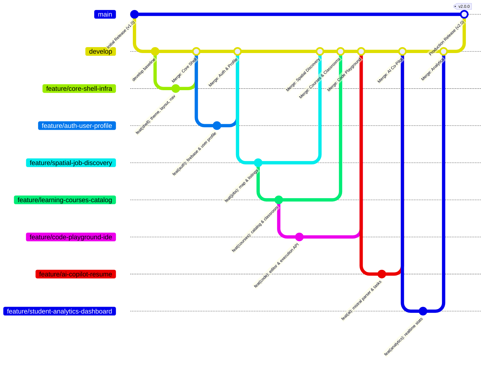

# 🗺️ CareerMap AI

> **Spatial Career Discovery, Real-Time Job Intelligence, University Classrooms & AI-Driven Upskilling across India.**

[](https://nextjs.org/)
[](https://react.dev/)
[](https://tailwindcss.com/)
[](https://firebase.google.com/)
[](https://mistral.ai/)
[](https://tavily.com/)
[](https://www.mapbox.com/)
[](https://careermap-ai.vercel.app)

---

## 🌟 Overview

**CareerMap AI** bridges the gap between spatial job hunting, skill acquisition, and real-time career growth for engineering students and tech professionals in India. Instead of navigating cluttered, text-heavy job boards and fragmented learning paths, CareerMap delivers a unified ecosystem featuring:

1. **Interactive 3D Spatial Job Map**: Geolocates users and uncovers nearby opportunities in real time sorted by physical distance.
2. **University-Grade Video Classrooms**: Modular learning paths curated from Harvard, Stanford, MIT, Google, Meta, IBM, and AWS with per-lesson video lectures and verifiable completion certificates.
3. **In-Browser Code Playground**: Multi-language serverless execution IDE with tabbed console input/output.
4. **AI Career Co-Pilot & Resume Parser**: Mistral AI-driven PDF resume parsing, skill gap analysis, personalized job & course recommendations, and dynamic micro-learning task generation.
5. **Real-Time Student Analytics**: Live streak monitoring, lecture completion tracking, and skill progression synced with Firebase Cloud Firestore.

---

## 🌿 Architecture Plan & Git Branching Strategy

To facilitate scalable team collaboration, rapid continuous integration, and clean separation of concerns, the CareerMap codebase is partitioned into **7 distinct modular feature branches** anchored around a stable trunk-based / GitFlow integration pipeline.

### 📐 Branching Topology & Integration Flow



---

### 🗂️ Feature Branch Decomposition Matrix

Each branch is self-contained with explicit domain responsibilities and owned files to prevent merge conflicts during concurrent development.

| # | Branch Name | Feature Domain & Responsibility | Target Directories & Core Files | Upstream Dependencies |
|:---:|:---|:---|:---|:---|
| **1** | `feature/core-shell-infra` | **Core Shell, Layout & UI Foundation**<br>App router shells, responsive navigation, theme context, fluid ambient backgrounds, button primitives, and global styling tokens. | • `src/app/layout.tsx`<br>• `src/app/globals.css`<br>• `src/components/layout/*`<br>• `src/components/ui/button.tsx`<br>• `src/components/theme/*`<br>• `src/lib/utils.ts` | Base `develop` (Foundation Layer) |
| **2** | `feature/auth-user-profile` | **Authentication & User Profile Management**<br>Firebase Auth (Google, GitHub, Email, Guest), Cloud Firestore sync, onboarding questionnaire, profile drawer, settings modal. | • `src/database/*`<br>• `src/app/login/*`<br>• `src/app/profile/*`<br>• `src/components/profile/*` | Depends on `feature/core-shell-infra` |
| **3** | `feature/spatial-job-discovery` | **Spatial Job Discovery & Mapbox Engine**<br>Geographic proximity sorting, 3D interactive map, job detail cards, company hiring directory, saved bookmarks, and Tavily/JSearch integration. | • `src/components/maps/*`<br>• `src/components/jobs/*`<br>• `src/components/views/AllJobsView.tsx`<br>• `src/components/views/SavedJobsView.tsx`<br>• `src/components/views/CompaniesView.tsx`<br>• `src/app/api/jobs/route.ts`<br>• `src/backend/jobUrls.ts`<br>• `src/backend/mockData.ts`<br>• `src/data/jobs.json`<br>• `scripts/generate_jobs.js` | Depends on `feature/core-shell-infra`, `feature/auth-user-profile` |
| **4** | `feature/learning-courses-catalog` | **Learning Hub & Video Classroom**<br>Free course catalog, multi-module video player, curriculum data structures (DSA, ML, MERN, Data Science, Linux, Git), assessment hooks, certificate generator. | • `src/app/courses/*`<br>• `src/components/courses/*`<br>• `src/data/courses/*`<br>• `src/data/data.ts`<br>• `src/data/classroomData.ts`<br>• `src/lib/courseData.ts`<br>• `src/app/api/seed-courses/*`<br>• `src/app/api/clean-courses/*` | Depends on `feature/core-shell-infra`, `feature/auth-user-profile` |
| **5** | `feature/ai-copilot-resume` | **AI Career Co-Pilot & Resume Intelligence**<br>Mistral AI PDF resume extractor, automatic skill/project parsing, daily learning task generator, AI skill-gap matching, micro-learning video links. | • `src/app/api/parse-resume/route.ts`<br>• `src/app/api/ai/generate-tasks/route.ts`<br>• `src/backend/resume/*`<br>• `src/backend/recommendations.ts`<br>• `src/lib/taskVideoUtils.ts`<br>• `src/components/dashboard/TaskVideoModal.tsx` | Depends on `feature/auth-user-profile`, `feature/learning-courses-catalog` |
| **6** | `feature/code-playground-ide` | **Interactive Code Playground & Execution**<br>Monaco/In-browser IDE, multi-language serverless code runner (Python, C++, Java, JS), tabbed I/O console, output clear/copy actions. | • `src/app/code/page.tsx`<br>• `src/app/api/execute/route.ts` | Depends on `feature/core-shell-infra` |
| **7** | `feature/student-analytics-dashboard` | **Real-Time Student Analytics & Progress**<br>Real-time progress overview, streak metrics, course completion modals, lecture status badges, and Firestore live data synchronization. | • `src/components/views/StudentDashboardView.tsx`<br>• `src/components/dashboard/LearningProgressDetailModal.tsx` | Integrates `feature/learning-courses-catalog` & `feature/auth-user-profile` |

---

### 💻 Developer Git Workflow & Commands

#### 1. Setup Integration Base (`develop`)
```bash
# Ensure local main is synchronized
git checkout main
git pull origin main

# Create and publish the develop integration branch
git checkout -b develop
git push -u origin develop
```

#### 2. Creating a Feature Branch
```bash
# Branch off develop for your specific feature
git checkout develop
git pull origin develop
git checkout -b feature/<branch-name>

# Example: Starting work on Courses
git checkout -b feature/learning-courses-catalog
```

#### 3. Standardized Conventional Commits
All commits must adhere to [Conventional Commits](https://www.conventionalcommits.org/):
- `feat(scope): add new capability` (e.g., `feat(code): support python code execution in playground`)
- `fix(scope): resolve bug` (e.g., `fix(dashboard): eliminate text wrapping on Real-Time badge`)
- `docs(scope): documentation updates`
- `style(scope): CSS, formatting, or visual adjustments`
- `refactor(scope): internal restructure without functional change`

#### 4. Rebase and PR Integration
```bash
# Keep feature branch up-to-date with develop before submitting PR
git checkout develop
git pull origin develop
git checkout feature/<branch-name>
git rebase develop

# Push feature branch to remote
git push -u origin feature/<branch-name>
```

---

## 🚀 Key Features

- **📍 Geolocation-Driven Discovery**: Automatically detects coordinates via browser geolocation and calculates Haversine distance to Indian job postings.
- **🗺️ Mapbox 3D Spatial Canvas**: Interactive 3D vector map with custom company markers, daylight styling, and clustered tech-hub exploration.
- **🎓 University-Grade Video Classrooms**: 8+ comprehensive courses (Harvard CS50x, Stanford ML, MIT 6.006, Google Cloud, Meta React, AWS Cloud, IBM Data Science, Linux) with per-lesson YouTube video player, completion checks, and PDF certificates.
- **💻 In-Browser Code Playground**: Full-screen IDE supporting Python, JavaScript, C++, and Java with an integrated tabbed execution console.
- **🤖 AI Resume Parser & Co-Pilot (Mistral AI)**:
  - Drag-and-drop PDF resume parsing.
  - Automatic extraction of skills, experience level, and projects.
  - Mistral AI daily task generation for closing targeted skill gaps.
  - Matched YouTube video lecture recommendations for every task.
- **📊 Real-Time Student Learning Dashboard**:
  - Streak counters and weekly learning metrics.
  - Live course completion tracking with progress bars.
  - Detailed course syllabus breakdown modal with instant lecture navigation.
- **🏢 Comprehensive Tech Leader Directory**: Curated profiles for 50+ tech leaders (Google, Microsoft, Amazon, Apple, Meta, Flipkart, Zomato, Razorpay) with direct ATS career portal links.
- **🔐 Firebase Authentication & Cloud Firestore**: Seamless OAuth (Google & GitHub), Email/Password, and Guest login with real-time profile and course state sync.

---

## 🛠️ Technology Stack

| Layer | Technologies |
|---|---|
| **Frontend Framework** | [Next.js 16 (App Router)](https://nextjs.org/), [React 19](https://react.dev/), [TypeScript 5](https://www.typescriptlang.org/) |
| **Styling & Motion** | [Tailwind CSS v4](https://tailwindcss.com/), [Framer Motion](https://www.framer.com/motion/), [Lucide React](https://lucide.dev/) |
| **Mapping Engine** | [Mapbox GL](https://www.mapbox.com/), [MapLibre GL](https://maplibre.org/), [React Map GL](https://visgl.github.io/react-map-gl/) |
| **AI Intelligence** | [Mistral AI API](https://mistral.ai/) (`mistral-small-latest`) for resume analysis and task synthesis |
| **Web Search & Jobs** | [Tavily Search API](https://tavily.com/), [JSearch RapidAPI](https://rapidapi.com/) |
| **Backend & Database** | Next.js Serverless Route Handlers, [Firebase Auth](https://firebase.google.com/products/auth), [Cloud Firestore](https://firebase.google.com/products/firestore) |
| **Code Execution Engine** | Serverless Code Runner API (`/api/execute`) with multi-language runtime support |
| **Deployment** | [Vercel](https://vercel.com/) (Edge Network & Serverless Functions) |

---

## 📂 Project Structure

```text
CAREER_MAP/
├── public/                                # Static branding, avatars & icons
├── src/
│   ├── app/
│   │   ├── api/
│   │   │   ├── ai/generate-tasks/route.ts # AI daily learning task generator
│   │   │   ├── clean-courses/route.ts     # Firestore course cleanup utility
│   │   │   ├── execute/route.ts           # Serverless multi-language code runner
│   │   │   ├── jobs/route.ts              # Proximity-sorted jobs API
│   │   │   ├── parse-resume/route.ts      # PDF text extractor & Mistral AI parser
│   │   │   └── seed-courses/route.ts      # Course catalog database seeder
│   │   ├── code/
│   │   │   └── page.tsx                   # In-browser Code Playground IDE
│   │   ├── courses/
│   │   │   ├── [id]/page.tsx              # Modular course classroom & video player
│   │   │   └── page.tsx                   # Course catalog with category & level filters
│   │   ├── dashboard/
│   │   │   └── page.tsx                   # Main dashboard shell (map, jobs, analytics)
│   │   ├── login/
│   │   │   └── page.tsx                   # Firebase OAuth & Guest sign-in
│   │   ├── profile/
│   │   │   └── page.tsx                   # User profile & resume management
│   │   ├── globals.css                    # Tailwind CSS v4 & custom glassmorphism styles
│   │   ├── layout.tsx                     # Root application layout & AuthProvider
│   │   └── page.tsx                       # High-converting landing page
│   ├── backend/
│   │   ├── resume/parser.ts               # Resume extraction & prompt engineering
│   │   ├── jobUrls.ts                     # Company career page resolver
│   │   ├── mockData.ts                    # Fallback data models
│   │   └── recommendations.ts             # AI-driven job & course matching engine
│   ├── components/
│   │   ├── courses/                       # Course cards, filters & certificate modal
│   │   ├── dashboard/                     # Learning progress & task video modals
│   │   ├── jobs/                          # Job rows, sidebar & detail overlay
│   │   ├── layout/                        # AppSidebar, DashboardHeader, LiquidNavbar, MobileDock
│   │   ├── maps/                          # InteractiveMap (Mapbox GL spatial canvas)
│   │   ├── profile/                       # OnboardingModal, UserProfileDrawer, ProfileSettings
│   │   ├── theme/                         # ThemeProvider & ThemeToggle
│   │   ├── ui/                            # Reusable UI primitives (buttons, dialogs)
│   │   └── views/                         # AllJobsView, SavedJobsView, CompaniesView, StudentDashboardView
│   ├── data/
│   │   ├── courses/                       # Course curriculum files (DSA, ML, MERN, Linux, etc.)
│   │   ├── classroomData.ts               # YouTube lesson mappings
│   │   ├── data.ts                        # Master course catalog
│   │   ├── jobs.json                      # Structured jobs dataset
│   │   └── types.ts                       # Shared TypeScript interfaces
│   ├── database/
│   │   ├── authContext.tsx                # Auth state, user profile CRUD & Firestore sync
│   │   └── config.ts                      # Firebase SDK initialization
│   └── lib/
│       ├── courseData.ts                  # Course loader & cache helpers
│       ├── taskVideoUtils.ts              # YouTube matching for AI tasks
│       └── utils.ts                       # Styling & classname utilities
├── scripts/
│   └── generate_jobs.js                   # Offline web search scraper (Tavily + Mistral)
├── .env.example                           # Example environment template
├── .env.local                             # Local environment secrets
├── PROJECT_STRUCTURE.md                   # Detailed technical component manifest
├── package.json                           # NPM dependencies and scripts
├── tsconfig.json                          # TypeScript configuration
└── README.md                              # This document
```

---

## ⚙️ Environment Variables

Create a `.env.local` file in the project root:

```env
# Mapbox Geocoding & Maps
NEXT_PUBLIC_MAPBOX_TOKEN="your_mapbox_public_token"

# AI & Web Search APIs
MISTRAL_API_KEY="your_mistral_api_key"
TAVILY_API_KEY="your_tavily_api_key"
RAPIDAPI_KEY="your_rapidapi_jsearch_key"

# Firebase Client Configuration
NEXT_PUBLIC_FIREBASE_API_KEY="your_firebase_api_key"
NEXT_PUBLIC_FIREBASE_AUTH_DOMAIN="your_project.firebaseapp.com"
NEXT_PUBLIC_FIREBASE_PROJECT_ID="your_project_id"
NEXT_PUBLIC_FIREBASE_STORAGE_BUCKET="your_project.firebasestorage.app"
NEXT_PUBLIC_FIREBASE_MESSAGING_SENDER_ID="your_sender_id"
NEXT_PUBLIC_FIREBASE_APP_ID="your_app_id"
```

---

## 🏃 Getting Started Locally

### 1. Clone the Repository
```bash
git clone https://github.com/dp2005317/CAREER_MAP.git
cd CAREER_MAP
```

### 2. Install Dependencies
```bash
npm install
```

### 3. Setup Environment
Copy `.env.example` to `.env.local` and add your API credentials:
```bash
cp .env.example .env.local
```

### 4. Run Development Server
```bash
npm run dev
```

Visit [http://localhost:3000](http://localhost:3000) in your browser.

---

## 📡 API Reference

### `GET /api/jobs`
Returns job postings sorted by Haversine proximity to the user's latitude and longitude.
- **Params**: `lat` (number), `lng` (number)

### `POST /api/execute`
Executes code in Python, JavaScript, C++, or Java and streams execution stdout/stderr back.
- **Body**: `{ language: string, code: string, input?: string }`

### `POST /api/parse-resume`
Extracts raw text from an uploaded resume PDF and runs Mistral AI structured extraction.
- **Body**: `FormData` with `file` (PDF)

### `POST /api/ai/generate-tasks`
Synthesizes personalized daily learning tasks based on the student's target role and missing skills.
- **Body**: `{ targetRole: string, skills: string[], currentProgress: object }`

---

## 🚢 Deployment

CareerMap is optimized for zero-configuration deployment on **Vercel**:

```bash
npx vercel --prod
```

Ensure all variables from `.env.local` are mirrored in **Vercel Project Settings → Environment Variables**.

---

## 📄 License

This project is open-source and licensed under the [MIT License](LICENSE).
